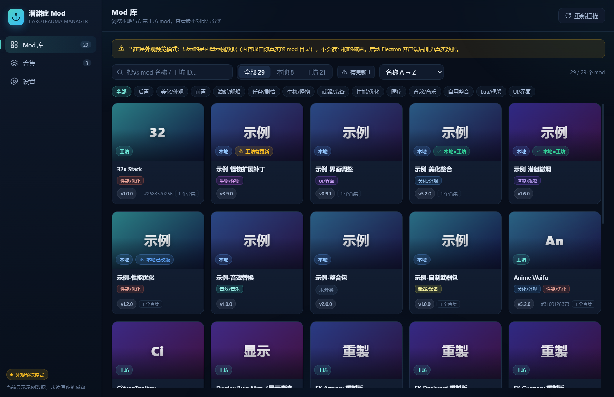
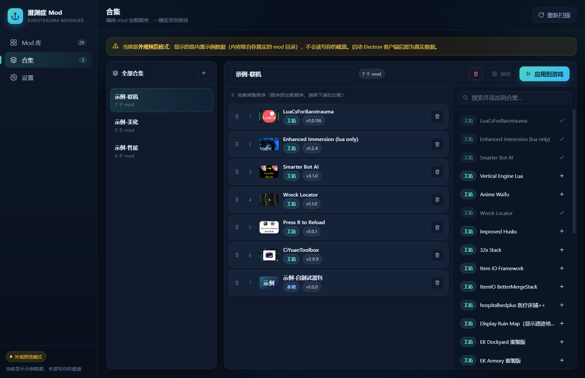

# 潜渊症 Mod 管理器

替代《潜渊症 / Barotrauma》内置 mod 管理器的桌面工具。合集编排、一键应用到游戏、本地 mod 与创意工坊版本对比、封面、按功能分类。

> 内置管理器的问题：不能按功能分类、看不到 mod 封面、本地自改的 mod 和创意工坊版本分不清、合集编辑要一个个点。



## 功能

**Mod 库**
- 卡片网格，显示封面、版本、来源（本地 / 创意工坊）、分类标签
- 版本对比状态：`工坊有更新` / `本地已改版` / `本地=工坊`
- 搜索、来源筛选、分类筛选、「有更新」快捷筛选、排序
- 工具栏与筛选条固定，只有卡片区滚动

**合集**
- 管理游戏的 `ModLists\*.xml`：新建 / 重命名 / 删除
- 拖拽排序（**顺序即加载顺序**）、搜索添加、移除、缺失提示
- **一键应用到游戏**：解析 → 备份 `config_player.xml` → 只替换 `contentpackages` 段

**Mod 详情**
- **创意工坊描述**：直接显示 mod 作者写的描述（保留标题层级、列表、粗体斜体、链接、分隔线），
  并附带订阅数 / 收藏数 / 浏览量 / 更新时间、工坊标签；长描述默认折叠
- 本地 ↔ 创意工坊版本对比
- **加入合集**：点一下加入/移出任意合集，也能当场新建合集并加进去
- **新建 / 删除分类标签**
- 设置封面、打开文件夹、跳转工坊页面
- 用创意工坊版覆盖本地版（自动快照）、把工坊版复制为新本地 mod
- **删除本地 mod**：连历史快照一起清掉

**启动游戏**
- 顶部「启动游戏」一键拉起潜渊症；找不到 exe 时自动交回 Steam 启动

**备份与回滚**
- **一键备份所有工坊 mod 到本地**：全量复制进 `LocalMods`，工坊更新或下架都不怕
  - 先规划再执行：先告诉你占多少磁盘、几个新建几个更新，确认后才动手
  - 优先取游戏实际加载的那份（`WorkshopMods\Installed`），长任务带进度、可取消
- **本地 mod 历史版本与回滚**：每个本地 mod **只保留最近 1 份快照**（改动前的状态），随时回到那个版本
  - 手动「创建快照」；此外**每次覆盖工坊版、每次再次备份工坊 mod 之前都会自动留一份**
  - 回滚前会先把当前状态顶上来当成新的那份快照，所以**回滚本身也能撤销**（再点一次就滚回去了）
  - 只留 1 份是为了省空间；想多留历史，把 `electron/services/backup.js` 里的 `MAX_SNAPSHOTS` 调大即可
- **删除本地 mod**：详情页一键删除，连它的历史快照一起清掉；可选同时从所有合集里移除引用

**封面**
- 创意工坊 mod 自动从 Steam 拉封面并缓存到本地，之后离线可用
- 本地 mod 默认占位图，可手动指定

## 截图



## 运行

从 [Releases](../../releases) 下载 `barotrauma-mod-manager-setup-<版本>.exe`，双击安装（**按用户安装，不需要管理员权限**，装到 `%LocalAppData%\Programs\`）。

首次打开会自动扫描常见 Steam 安装位置来填充目录设置；没检测到就在「设置」页点「自动检测」或手动指定。

### 自动更新

装好之后**不用再手动下载**：

- 每次启动会静默向 GitHub 查一次新版本，有更新时界面顶部出现提示条
- 点「下载更新」→ 下载完点「立即重启安装」→ 程序自动重启到新版本
- 也可以在「设置 → 关于与更新」里手动检查，并查看更新说明

> 更新走的是 [electron-updater](https://www.electron.build/auto-update) + GitHub Releases：
> 它会读取最新 release 里的 `latest.yml`，与当前版本比较，然后下载安装包。
> 所以**发布新版本时 `latest.yml` 必须一起上传**，否则更新会失败（见下面的「发布新版本」）。

### 需要填的 6 个目录

| 设置项 | 说明 |
| --- | --- |
| 游戏根目录 | 潜渊症安装目录，如 `…\steamapps\common\Barotrauma` |
| 合集文件夹 | `…\Barotrauma\ModLists` |
| 本地 mod 文件夹 | `…\Barotrauma\LocalMods` |
| 创意工坊 mod 文件夹 | `…\steamapps\workshop\content\602960` |
| config_player.xml | 「应用到游戏」写入的目标 |
| 已安装的工坊 mod 目录 | `%LocalAppData%\…\WorkshopMods\Installed`（游戏**实际加载**的位置） |

## 从源码构建

需要 Node.js 18+ 与 pnpm。

```bash
pnpm install
pnpm app            # 构建界面 + 启动桌面客户端
```

其它命令：

| 命令 | 作用 |
| --- | --- |
| `pnpm dev` | 只跑界面开发服务器（浏览器打开，走内置示例数据） |
| `pnpm build` | 只构建界面产物到 `dist/` |
| `pnpm start` | 用已构建的 `dist/` 启动桌面客户端 |
| `pnpm run pack` | 打包成 NSIS 安装包（输出到 `release/`） |

> 要用 `pnpm run pack`。裸写 `pnpm pack` 会命中 pnpm 自己的内置命令（打 npm 包），不会走这里的打包脚本。

打包产物有三个，缺一不可：

```
release\barotrauma-mod-manager-setup-<版本>.exe            安装包
release\barotrauma-mod-manager-setup-<版本>.exe.blockmap   增量更新用
release\latest.yml                                        自动更新清单
```

> 安装包文件名刻意用 ASCII：`latest.yml` 里的 `path` 必须和实际上传的文件名**完全一致**，
> 用中文名时 electron-builder 生成的两者会对不上，导致更新 404。

图标由 `node scripts/make-icon.cjs` 生成 —— 纯 Node 手写 PNG 编码 + ICO 封装，不依赖任何图形库。

<details>
<summary>首次打包可能因 Windows 符号链接权限失败（点开看解决办法）</summary>

electron-builder 会解压 `winCodeSign-2.6.0.7z`，包里含两个 macOS 的符号链接
（`darwin/10.12/lib/libcrypto.dylib`、`libssl.dylib`）。普通 Windows 账户没有
「创建符号链接」特权，解压会报：

```
ERROR: Cannot create symbolic link … 客户端没有所需的特权。
```

这对 Windows 打包没有实际影响 —— 该目录里 Windows 侧真正需要的只有 `rcedit-x64.exe`
（用于写入 exe 图标与版本信息），它其实已经解压出来了。两种解法任选：

1. **把已解压内容补到正式缓存名**（推荐，不用改系统设置）：解压失败后会留下若干数字名的
   临时目录，把其中一个复制成 `winCodeSign-2.6.0`，再重跑 `pnpm run pack` 即可 ——
   electron-builder 的 `getBin` 只要看到该目录存在就会跳过解压。

   ```powershell
   $cache = "$env:LOCALAPPDATA\electron-builder\Cache\winCodeSign"
   $tmp = Get-ChildItem $cache -Directory | Where-Object { $_.Name -match '^\d+$' } | Select-Object -First 1
   Copy-Item $tmp.FullName (Join-Path $cache 'winCodeSign-2.6.0') -Recurse -Force
   ```

2. 开启 Windows 开发者模式（设置 → 系统 → 开发者选项），账号即可获得该特权。

</details>

## 发布新版本

1. 改 `package.json` 里的 `version`（例如 `0.1.0` → `0.2.0`）。**不改版本号客户端不会认为有更新。**
2. 打包：

   ```bash
   pnpm run pack
   ```

3. 到 [Releases](../../releases) → **Draft a new release**：
   - **Choose a tag** 填 `v0.2.0`（与 `version` 保持一致）→ 点 **Create new tag**
   - 上传**两个**文件（只传 exe 是不够的）：
     - `release\barotrauma-mod-manager-setup-0.2.0.exe`
     - `release\latest.yml`
   - ⚠️ **不要勾 `Set as a pre-release`** —— 预发布版本客户端会直接跳过
   - 点 **Publish release**

4. 老版本客户端下次启动就会提示更新，点两下即可完成升级。

> 也可以让 electron-builder 自己建 release 并上传，省掉手动传文件：
>
> ```powershell
> $env:GH_TOKEN='<有 repo 权限的 token>'
> pnpm run pack -- --publish always
> ```

## 工作原理

### 合集文件格式

游戏的合集是 `ModLists\` 下的 XML，格式很简单：

```xml
<?xml version="1.0" encoding="utf-8"?>
<mods name="联机">
  <Vanilla />
  <Workshop name="Lua For Barotrauma" id="2559634234" />
  <Local name="我的自改版" />
</mods>
```

- **创意工坊 mod 靠 `id` 定位**，`name` 只是备注 —— 它经常过期（比如合集里写着
  `Lua For Barotrauma`，mod 现在其实叫 `LuaCsForBarotrauma`）。本工具一律以 `id` 为准，
  显示时用 mod 当前的真实名称。
- 本地 mod 靠 `name` 定位，也就是 `LocalMods` 下的文件夹名。
- **条目顺序就是加载顺序**，所以顺序可拖拽调整。

### 「应用到游戏」是怎么写的

游戏的当前启用列表存在 `config_player.xml` 的 `<contentpackages>` 段里，是**解析后的绝对路径**，
不是合集名。所以应用合集时会：

1. 把 `Workshop` 条目解析成 `…\WorkshopMods\Installed\{id}\filelist.xml`
   （**注意**：游戏实际加载的是 `Installed` 目录，不是 Steam 的 `workshop\content` 订阅缓存）
2. 把 `Local` 条目解析成 `…\LocalMods\{名称}\filelist.xml`
3. 备份 `config_player.xml.bak-<时间戳>`
4. **只替换** `<contentpackages>` 段

第 4 步是字符串级替换而非整份重写，并且刻意沿用原文件的行尾风格（CRLF/LF）与缩进、
保留 UTF-8 BOM —— 也就是段外的内容**逐字节不变**。如果文件里没有该段，直接中止、不写任何内容。

### 版本对比

每个 mod 的 `filelist.xml` 里有 `modversion`、`steamworkshopid` 等字段。
**本地复制的 mod 通常保留着原来的 `steamworkshopid`**，所以能精确匹配到工坊对应版本，
再比版本号。

版本号比较按段拆分；段数少的一方按 0 补齐，因此 `2.0` 与 `2.0.0` 视为相同
（否则同一版本会被误报成「工坊有更新」）。非纯数字的段回退字符串比较。

### 封面

走 Steam 的公开接口 `ISteamRemoteStorage/GetPublishedFileDetails`（**不需要 API Key**），
一次请求可带 50 个 id —— 100 多个 mod 只需 3 次请求，返回里就有 `preview_url`，
下载后缓存到本地。

> 不用抓商店页 `og:image` 的方案：Steam 现在返回 SSR 页面，HTML 里已经没有 `og:image`，抓取不可靠。

只有接口**明确答复**该条目没有封面时才写负面缓存；网络错误 / 被限流一律不写，
避免一次限流导致封面长期不刷新。

### 创意工坊描述

同一个接口里就有 `description`（作者写的原文，Steam BBCode 格式）、`tags` 和订阅/收藏/浏览量，
按需取回并在本地缓存 7 天。

描述**来自第三方作者，内容不可信**，所以界面只把它解析成结构化数据再用组件渲染，
**绝不注入原始 HTML**；其中的链接也只用点击事件交给主进程打开，不放进 `<a href>`，
避免界面被导航走。`[img]` 只显示占位文字、不加载图片。

## 安全说明

- **应用合集**：先备份再写，只动 `<contentpackages>` 段，段外逐字节不变，缺段则中止。
- **用创意工坊版覆盖本地**：先把本地文件夹**同盘改名**到 `LocalMods` 的**同级**目录
  `ModManagerBackups\`（改名是瞬时的，不占额外空间），失败会自动回滚。
  备份刻意不放在 `LocalMods` 里，避免被游戏当成 mod 扫描到。
- **合集文件名**做了目录穿越拦截。
- **备份与快照**都放在 `LocalMods` 的**同级**目录 `ModManagerBackups\`：
  `<mod 名>\<时间戳>\`。刻意不放进 `LocalMods`，避免被游戏当成 mod 扫描到；
  也不要手改快照文件夹名（时间戳就是它的 id）。快照是完整副本，攒多了会占空间，可在详情页逐个删除。
- 本工具自身的设置数据存在 `%AppData%\潜渊症Mod管理器\`：`settings.json`、`categories.json`、
  `previews\`（封面缓存）、`covers\`（手动设置的封面）。只在本机，不上传。

## 常见问题

**Q：应用合集后游戏里没生效？**
A：确认「设置」里的 `config_player.xml` 指向的是游戏根目录下那份，并且改完之后重启游戏。

**Q：某些 mod 没有封面？**
A：Steam 接口对该条目没返回封面图（部分 mod 本来就没上传预览图），会显示占位色块。

**Q：本地 mod 显示「无工坊对应」？**
A：该 mod 的 `filelist.xml` 里没有 `steamworkshopid`，无法自动匹配（自制的或改了标识的 mod）。
   这是正常的，不影响使用。

**Q：工坊 mod 卡片上写「未安装」/ 应用时提示有 mod 没安装？**
A：说明它在 Steam 订阅目录里、但游戏还没把它装到 `WorkshopMods\Installed`。
   启动一次游戏即可自动安装。

## 开发

```
electron/            主进程
  main.js            窗口 + 启动
  preload.js         暴露给界面的 window.api
  protocol.js        local-img:// 协议（显示本地图片）
  services/
    index.js         IPC 注册
    detect.js        自动检测 Steam / 游戏目录
    settings.js      目录设置读写
    mods.js          扫描 mod、解析 filelist.xml、版本对比
    modlists.js      合集文件读写
    config.js        应用到 config_player.xml
    steam.js         工坊封面（公开接口 + 缓存）
    categories.js    分类规则与标签持久化
    updater.js       自动更新（electron-updater + GitHub Releases）
    backup.js        快照 / 回滚 / 一键备份工坊 mod
    fsutil.js        复制目录、统计体积、文件名清洗等
src/                 界面（React + TypeScript，无 UI 框架依赖，手写 CSS）
  workshopText.tsx   工坊描述的 BBCode → 安全 React 节点
scripts/             自检与工具脚本
```

界面层在检测不到 `window.api` 时会自动回落到内置示例数据 —— 所以 `pnpm dev` 直接用浏览器
就能看界面，不需要启动 Electron。

### 自检

```bash
node scripts/test-backend.cjs                # 后端逻辑（合成样本，不依赖本机数据）
node scripts/test-preview.cjs                # 封面服务（需要联网）
pnpm exec electron scripts/smoke-app.cjs     # 端到端（真实目录，只读）
pnpm exec electron scripts/shots.cjs         # 界面截图 + 滚动/交互校验
```

`test-backend.cjs` 覆盖了 `filelist.xml` 解析（含单引号、老格式 `version` 属性、BOM、
以及 `modversion` 被 `gameversion` 误匹配的经典坑）、版本比较、合集往返、
以及「应用到 config 时区域外逐字节不变 / BOM 保留 / 缺段中止」。

要指定游戏目录时可用环境变量 `BMM_GAME_DIR` / `BMM_WORKSHOP_DIR`。

## 协议

[MIT](LICENSE)
